# Informe de Pruebas

> **Estado:** ✅ Completado — Fase 7 del roadmap (2026-09-12).
> **Requerimiento:** RF-4.2 del BRIEF §10 — pruebas de **todos los endpoints** de `docs/API.md` y de la **lógica de negocio**, con **un screenshot por prueba** (anotado con método, ruta y resultado esperado vs obtenido).
> **Complemento automatizado:** suite Vitest (`npm test`, 38 tests) sobre la lógica del Bloque 3 (bulk transaccional, repetidas `cantidad − 1`, faltantes).

## 1. Metodología

- **Entorno:** servidor en vivo `http://localhost:3000` (Hono + Prisma + MySQL 8 · `docker-compose`), base reseteada al estado del seed (álbum 1 “Copa Mundial 2026” + 6 láminas).
- **Cliente de pruebas:** recorrido manual de cada endpoint con un cliente HTTP (Thunder Client / Postman), un screenshot por prueba. Cada captura muestra **método, URL, body de solicitud, código y cuerpo de respuesta, y la comparación esperado vs obtenido**.
- **Estado de la BD durante las pruebas:** los casos que crean datos (PR-01, PR-09, PR-11, PR-21…) trabajan sobre el álbum de prueba 2 “Música 2025” y su lámina n.º 7; las pruebas de lógica (faltantes/repetidas/estadísticas) leen el álbum 1 del seed. Al final, los registros de prueba se eliminan y la BD vuelve al seed.

## 2. Resumen de resultados

**31 pruebas (26 API + 5 vistas + 1 flujo web), 100 % con resultado esperado = obtenido.**

| Caso de negocio | Pruebas | Resultado |
|---|---|---|
| CRUD de álbumes (crear → listar → detalle → actualizar → eliminar) | PR-01 a PR-04, PR-26 | ✔ |
| CRUD de láminas (crear, detalle, actualizar, parcial, eliminar) | PR-09, PR-16…PR-18, PR-25 | ✔ |
| Carga masiva OK (lote de 4+) y con duplicado → 409 rollback | PR-11, PR-12 | ✔ |
| Faltantes y repetidas (3 estados, `cantidadRepetidas = cantidad − 1`) | PR-13, PR-14 | ✔ |
| Estadísticas del álbum (66.7 % con seed) | PR-15 | ✔ |
| Subida de foto + acceso por `/uploads/...` | PR-21 | ✔ |
| Errores 400 (validación / id inválido / PATCH vacío / foto inválida) | PR-05, PR-06, PR-19, PR-23 | ✔ |
| Errores 404 (álbum, lámina, ruta API desconocida) | PR-07, PR-20, PR-24 | ✔ |
| Errores 409 (duplicado al crear y al actualizar) | PR-10, PR-22 | ✔ |
| Vistas web MVC (listado, detalle, formularios, faltantes/repetidas, alta por formulario) | PR-27…PR-33 | ✔ |

---
## API — Álbumes

### PR-01 — Crear álbum (éxito)
- **Método/Ruta:** `POST /api/albumes`
- **Solicitud:** `{ "nombre": "Música 2025", "imagen": "https://ejemplo.com/portada-musica.png", "fechaLanzamiento": "2025-03-01", "tipoLaminas": "Música", "descripcion": "Álbum de artistas latinos" }`
- **Esperado:** `201 Created` con `id` generado.
- **Obtenido:** `201 Created` ✔ (álbum `id: 2`)
- **Screenshot:** `screenshots/01-crear-album.png`

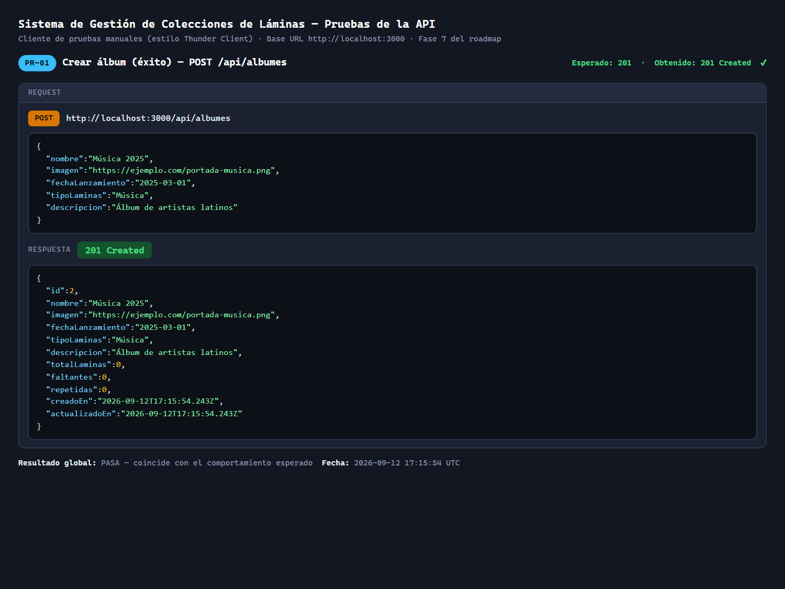

### PR-02 — Listar álbumes
- **Método/Ruta:** `GET /api/albumes`
- **Esperado:** `200 OK` — array con el seed (álbum 1) y el álbum 2 creado en PR-01.
- **Obtenido:** `200 OK` ✔
- **Screenshot:** `screenshots/02-listar-albumes.png`

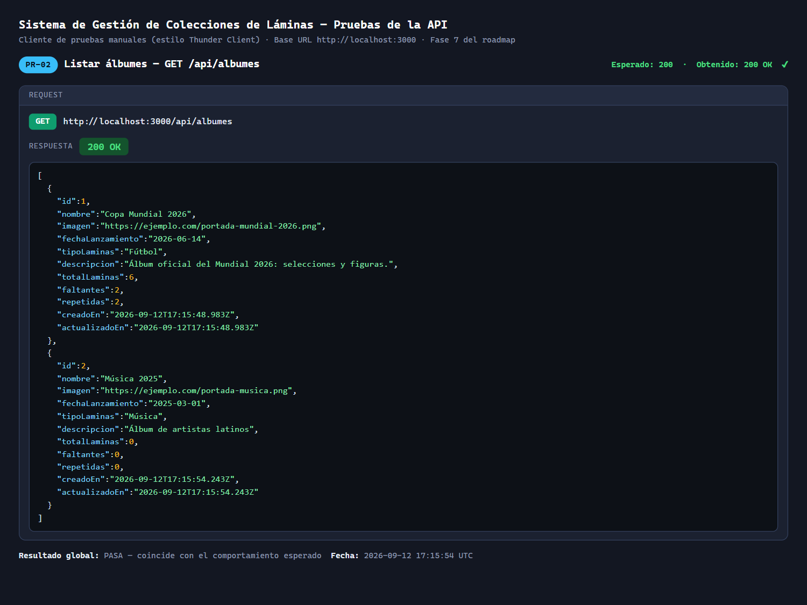

### PR-03 — Detalle de álbum
- **Método/Ruta:** `GET /api/albumes/2`
- **Esperado:** `200 OK` con el álbum 2 y totales derivados.
- **Obtenido:** `200 OK` ✔
- **Screenshot:** `screenshots/03-detalle-album.png`

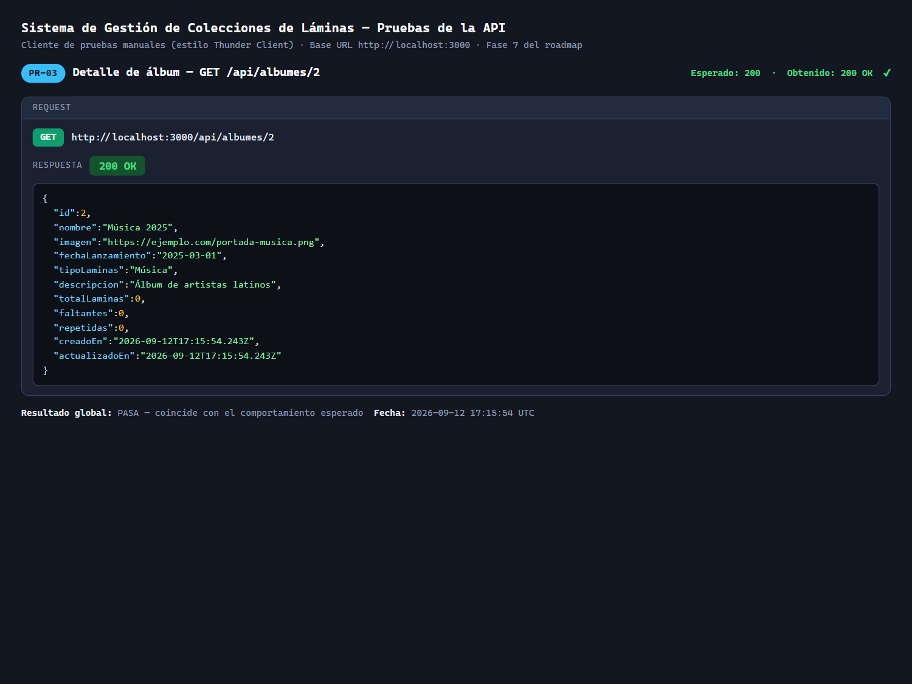

### PR-04 — Actualizar álbum (completo)
- **Método/Ruta:** `PUT /api/albumes/2`
- **Solicitud:** álbum completo con `nombre: "Música 2025 (edición)"`, `imagen: null`.
- **Esperado:** `200 OK` con el álbum actualizado.
- **Obtenido:** `200 OK` ✔
- **Screenshot:** `screenshots/04-actualizar-album.png`

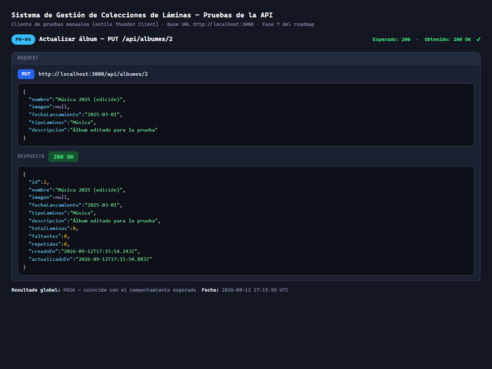

### PR-05 — Validación 400 (body vacío)
- **Método/Ruta:** `POST /api/albumes` con `{}`
- **Esperado:** `400 Bad Request` con errores por campo (`nombre`, `tipoLaminas`, `fechaLanzamiento`).
- **Obtenido:** `400 Bad Request` ✔ — `{ "error": "Datos inválidos", "detalles": [ ... ] }`
- **Screenshot:** `screenshots/05-validacion-400.png`

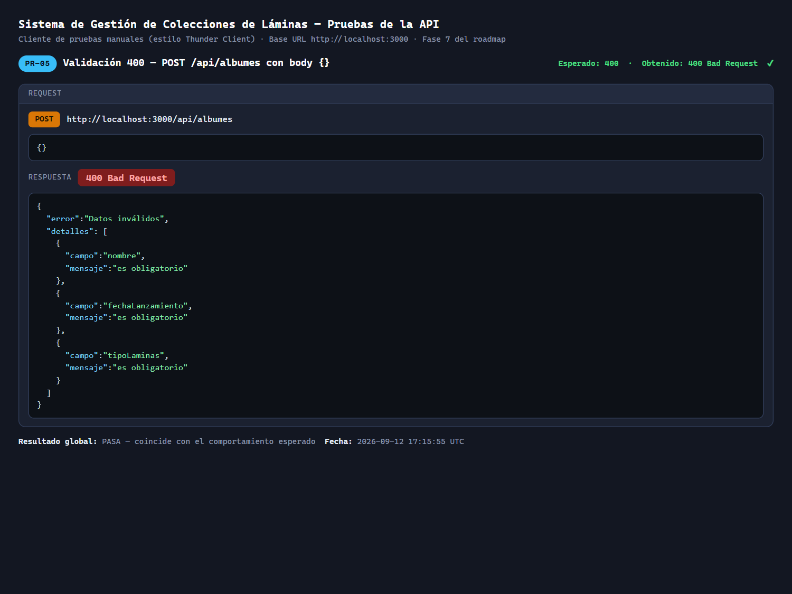

### PR-06 — Id inválido 400
- **Método/Ruta:** `GET /api/albumes/abc`
- **Esperado:** `400 Bad Request` — `id` debe ser entero positivo.
- **Obtenido:** `400 Bad Request` ✔
- **Screenshot:** `screenshots/06-id-invalido-400.png`

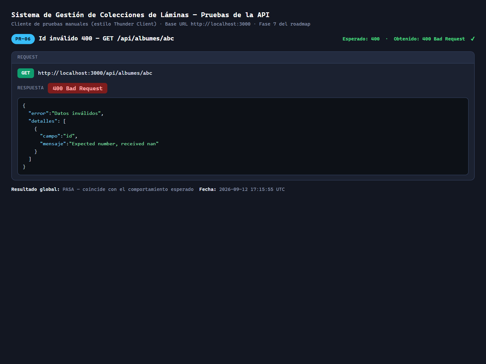

### PR-07 — Álbum inexistente 404
- **Método/Ruta:** `GET /api/albumes/9999`
- **Esperado:** `404 Not Found` — `{ "error": "Álbum no encontrado", "detalles": [] }`
- **Obtenido:** `404 Not Found` ✔
- **Screenshot:** `screenshots/07-album-404.png`

---
## API — Láminas de un álbum

### PR-08 — Láminas del álbum
- **Método/Ruta:** `GET /api/albumes/1/laminas`
- **Esperado:** `200 OK` con las 6 láminas del seed (números 1–6, ordenadas).
- **Obtenido:** `200 OK` ✔
- **Screenshot:** `screenshots/08-laminas-del-album.png`

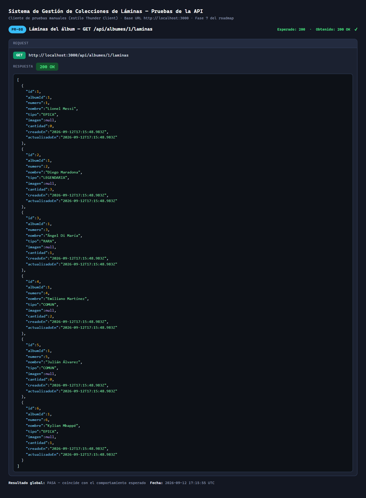

### PR-09 — Crear lámina
- **Método/Ruta:** `POST /api/albumes/2/laminas`
- **Solicitud:** `{ "numero": 7, "nombre": "Bad Bunny", "tipo": "RARA", "cantidad": 1 }`
- **Esperado:** `201 Created` con la lámina creada (`id: 7`).
- **Obtenido:** `201 Created` ✔
- **Screenshot:** `screenshots/09-crear-lamina.png`

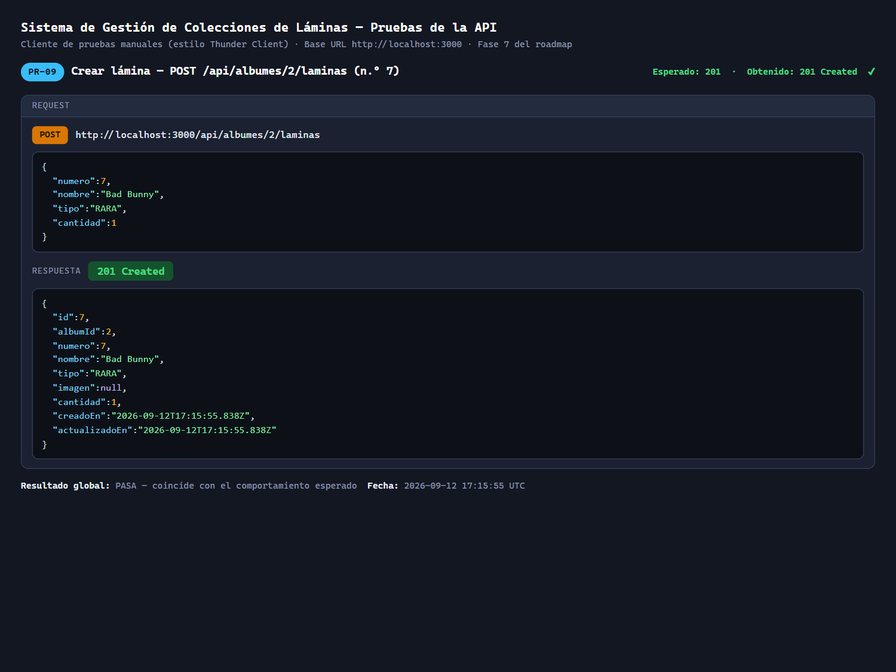

### PR-10 — Número duplicado 409
- **Método/Ruta:** `POST /api/albumes/1/laminas` con `numero: 1` (ya existe en el seed)
- **Esperado:** `409 Conflict` — `{ "error": "Ya existe una lámina con el número 1 en este álbum", "detalles": [] }`
- **Obtenido:** `409 Conflict` ✔ (no se inserta nada)
- **Screenshot:** `screenshots/10-duplicado-409.png`

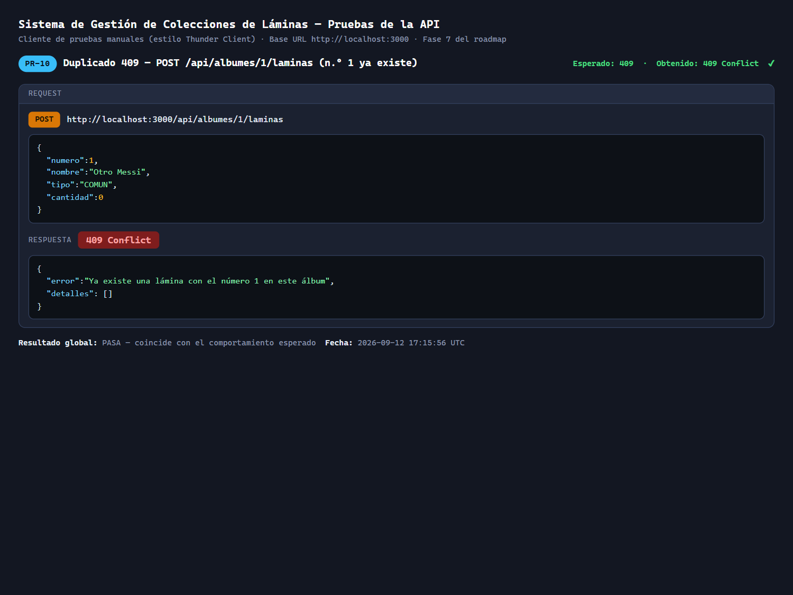

### PR-11 — Carga masiva exitosa (lote de 4+)
- **Método/Ruta:** `POST /api/albumes/2/laminas/bulk`
- **Solicitud:** lote de 4 láminas: números 8, 9, 10 y 11 (`Vinicius Jr.`, `Jude Bellingham`, `Rodri Hernández`, `Pedri González`).
- **Esperado:** `201 Created` con `{ "creadas": 4, "laminas": [...] }`.
- **Obtenido:** `201 Created` ✔ — transacción inserta las 4.
- **Screenshot:** `screenshots/11-bulk-exito.png`

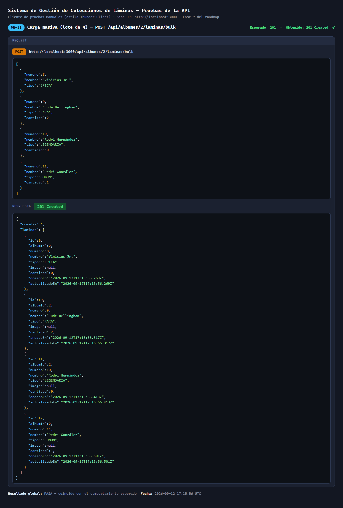

### PR-12 — Bulk con duplicado → 409 y rollback total
- **Método/Ruta:** `POST /api/albumes/2/laminas/bulk`
- **Solicitud:** `[ numero 60, numero 61, numero 7 ]` — el n.º 7 ya existe (PR-09).
- **Esperado:** `409 Conflict` y **rollback completo** (no se inserta ninguna).
- **Obtenido:** `409 Conflict` ✔ — transacción todo-o-nada; los n.º 60/61 no se insertaron.
- **Screenshot:** `screenshots/12-bulk-409.png`

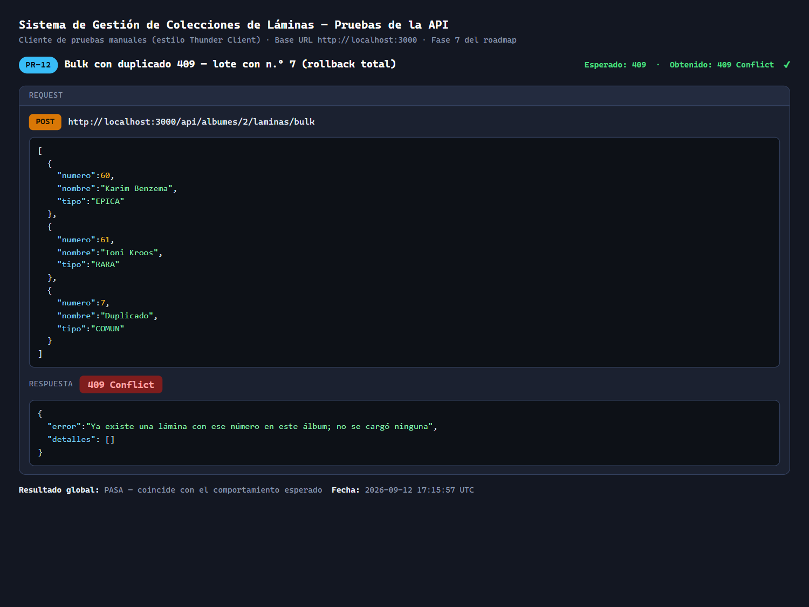

---
## API — Reglas de negocio (álbum 1 del seed)

### PR-13 — Láminas faltantes
- **Método/Ruta:** `GET /api/albumes/1/laminas/faltantes`
- **Esperado:** `200 OK` con `totalFaltantes: 2` (Messi y Julián Álvarez, `cantidad = 0`).
- **Obtenido:** `200 OK` ✔
- **Screenshot:** `screenshots/13-faltantes.png`

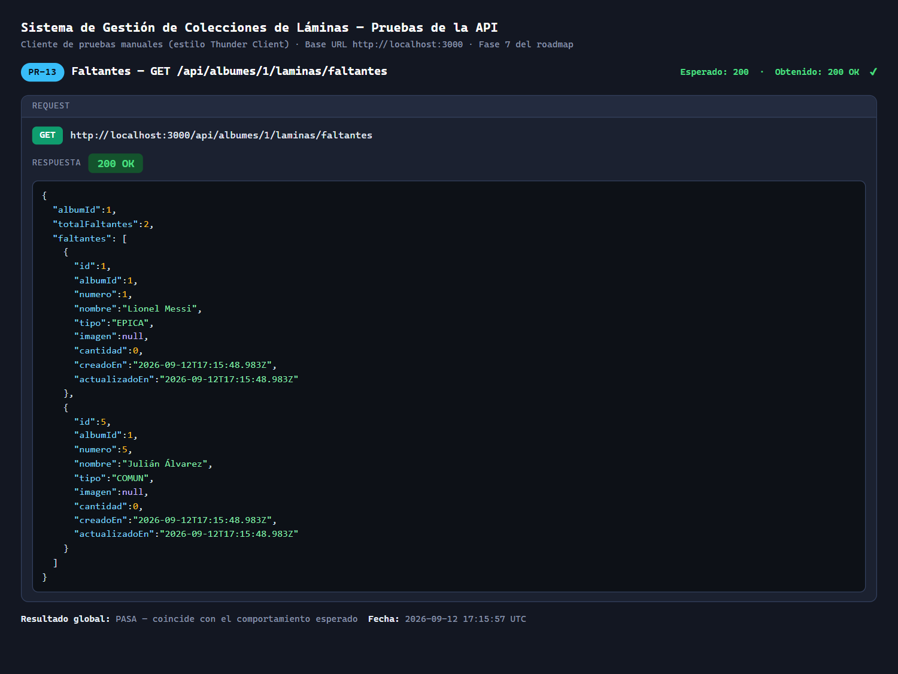

### PR-14 — Láminas repetidas (`cantidadRepetidas = cantidad − 1`)
- **Método/Ruta:** `GET /api/albumes/1/laminas/repetidas`
- **Esperado:** `200 OK` con `totalRepetidas: 2`; Maradona `cantidad 3 → cantidadRepetidas 2`; Martínez `cantidad 2 → cantidadRepetidas 1`.
- **Obtenido:** `200 OK` ✔ — la primera copia no es repetida (regla BRIEF §7.2).
- **Screenshot:** `screenshots/14-repetidas.png`

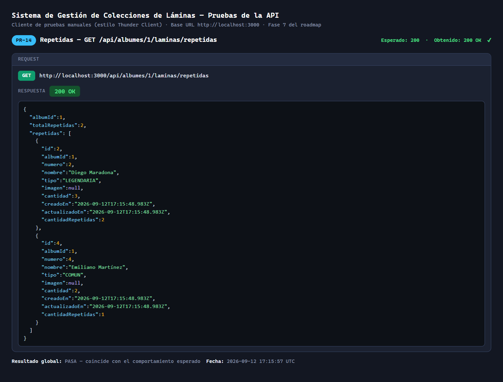

### PR-15 — Estadísticas del álbum
- **Método/Ruta:** `GET /api/albumes/1/estadisticas`
- **Esperado:** `200 OK` con `{ "totalLaminas": 6, "faltantes": 2, "repetidas": 2, "porcentajeCompletado": 66.7 }`.
- **Obtenido:** `200 OK` ✔
- **Screenshot:** `screenshots/15-estadisticas.png`

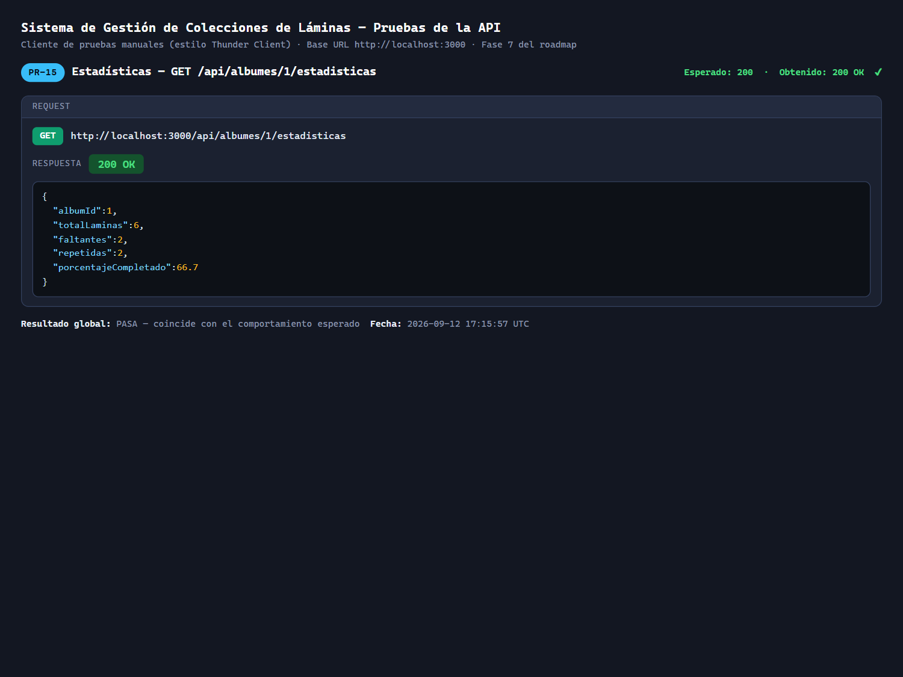

---
## API — Láminas por id

### PR-16 — Detalle de lámina
- **Método/Ruta:** `GET /api/laminas/7`
- **Esperado:** `200 OK`
- **Obtenido:** `200 OK` ✔
- **Screenshot:** `screenshots/16-detalle-lamina.png`

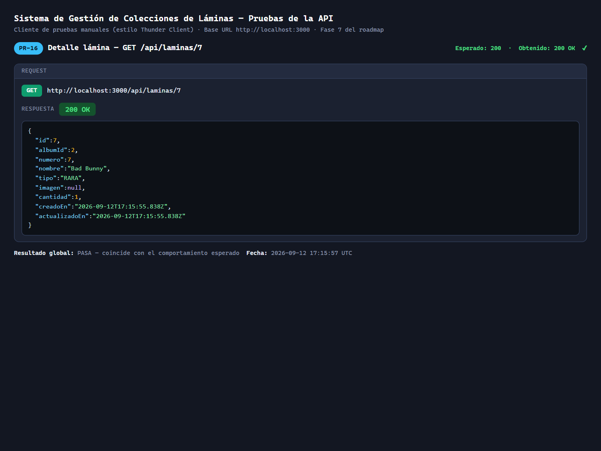

### PR-17 — Actualizar lámina (completo)
- **Método/Ruta:** `PUT /api/laminas/7` — `{ "numero": 7, "nombre": "Bad Bunny (ed.)", "tipo": "RARA", "cantidad": 3 }`
- **Esperado:** `200 OK`
- **Obtenido:** `200 OK` ✔
- **Screenshot:** `screenshots/17-actualizar-lamina.png`

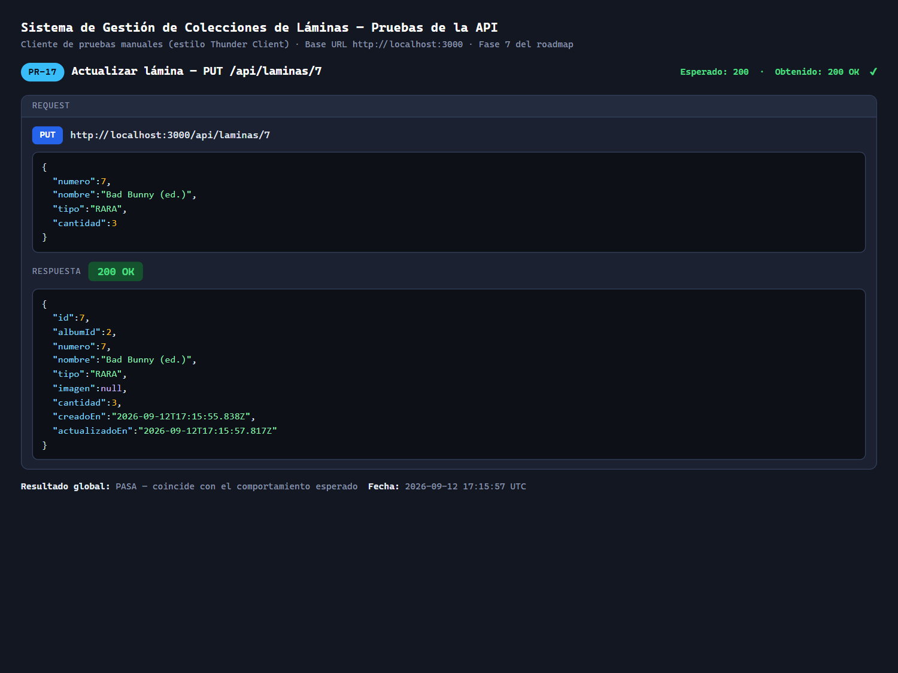

### PR-18 — Actualización parcial (PATCH)
- **Método/Ruta:** `PATCH /api/laminas/7` — `{ "cantidad": 5 }`
- **Esperado:** `200 OK` — solo cambia `cantidad`.
- **Obtenido:** `200 OK` ✔
- **Screenshot:** `screenshots/18-patch-parcial.png`

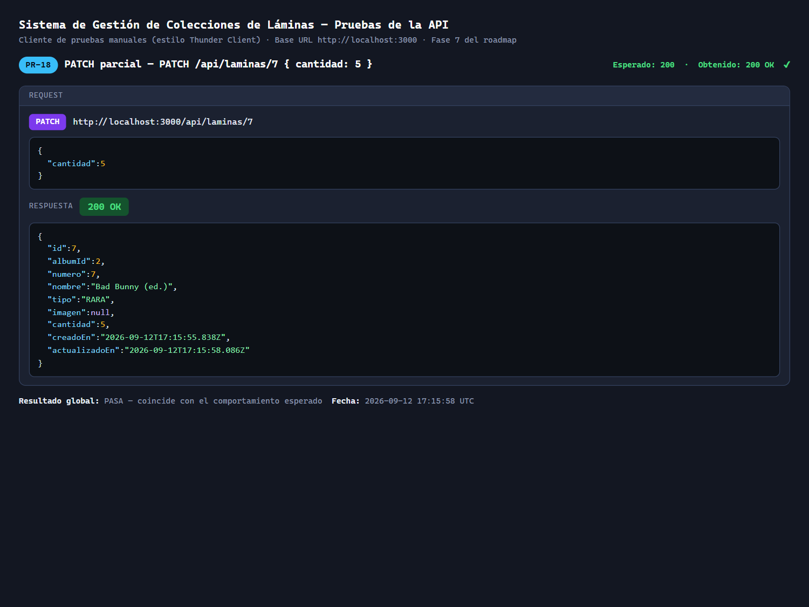

### PR-19 — PATCH sin campos 400
- **Método/Ruta:** `PATCH /api/laminas/7` con `{}`
- **Esperado:** `400 Bad Request` — `{ "error": "Datos inválidos", "detalles": [ { "campo": "(cuerpo)", ... } ] }`
- **Obtenido:** `400 Bad Request` ✔
- **Screenshot:** `screenshots/19-patch-vacio-400.png`

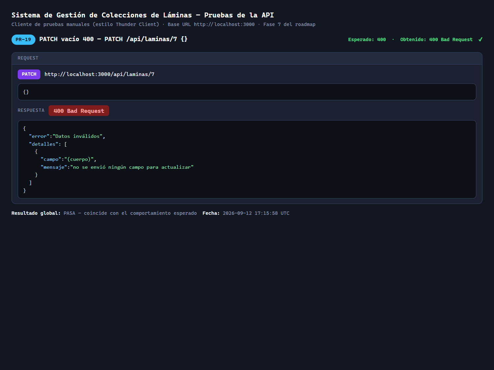

### PR-20 — Lámina inexistente 404
- **Método/Ruta:** `GET /api/laminas/99999`
- **Esperado:** `404 Not Found` — `{ "error": "Lámina no encontrada", "detalles": [] }`
- **Obtenido:** `404 Not Found` ✔
- **Screenshot:** `screenshots/20-lamina-404.png`

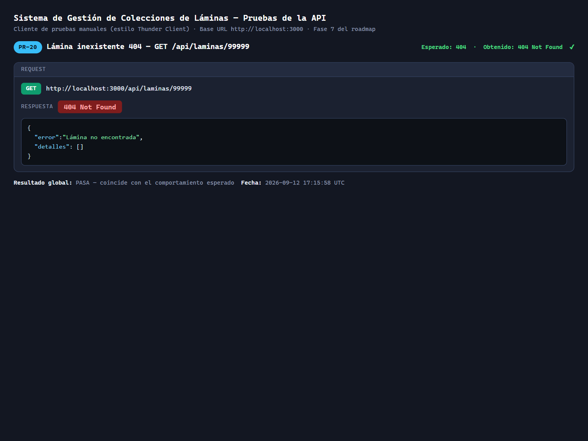

### PR-21 — Subir foto y servirla por `/uploads/...`
- **Método/Ruta:** `POST /api/laminas/7/foto` (multipart, campo `foto` = `prueba-fase7.png`) y luego `GET /uploads/laminas/7_*.png`
- **Esperado:** `200 OK` con `{ "id": 7, "imagen": "/uploads/laminas/7_....png" }`; el archivo se sirve `200` con `content-type: image/png`.
- **Obtenido:** `200 OK` ✔ y `GET /uploads/...` → `200 · image/png` ✔
- **Screenshot:** `screenshots/21-subir-foto.png`

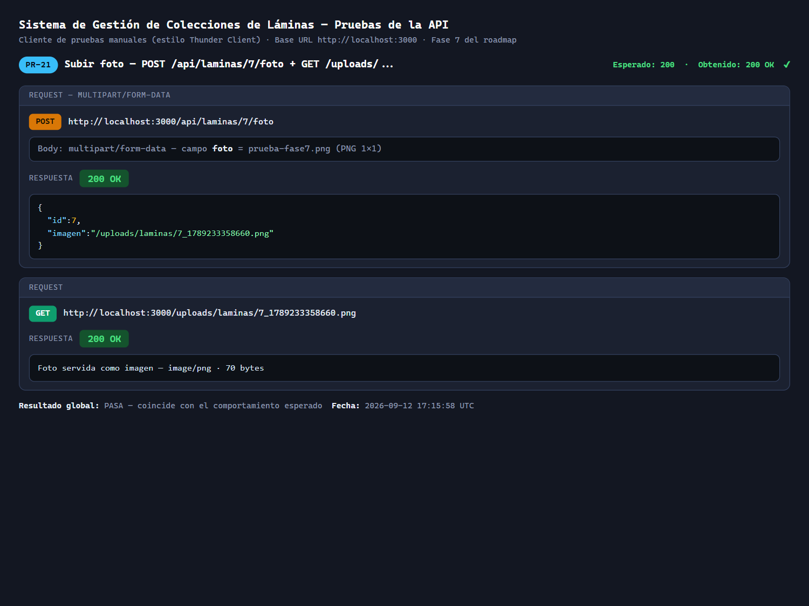

### PR-22 — PATCH con número en conflicto 409
- **Método/Ruta:** `PATCH /api/laminas/7` con `{ "numero": 8 }` (el 8 ya pertenece al álbum, criado por el bulk)
- **Esperado:** `409 Conflict` (unicidad `(albumId, numero)`).
- **Obtenido:** `409 Conflict` ✔
- **Screenshot:** `screenshots/22-patch-conflicto-409.png`

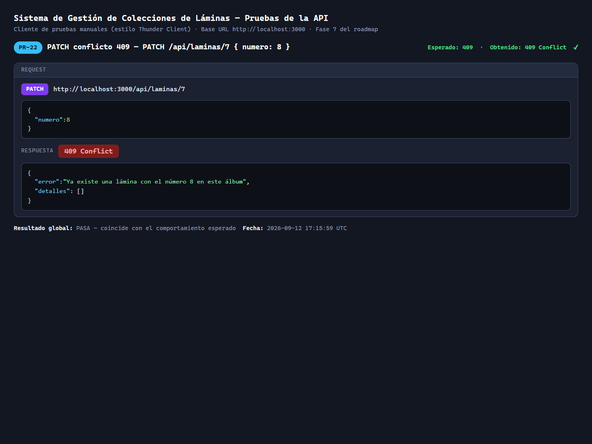

### PR-23 — Foto inválida 400 (extensión no permitida)
- **Método/Ruta:** `POST /api/laminas/7/foto` con archivo `nota.txt`
- **Esperado:** `400 Bad Request` — “Formato de imagen no permitido (jpg, jpeg, png, webp o gif)”.
- **Obtenido:** `400 Bad Request` ✔
- **Screenshot:** `screenshots/23-foto-invalida-400.png`

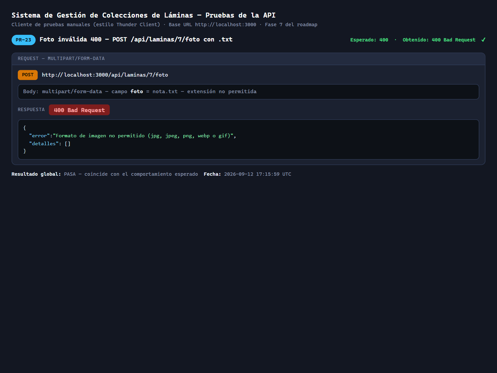

---
## API — Peticiones misceláneas

### PR-24 — Ruta API desconocida 404
- **Método/Ruta:** `GET /api/ruta/que/no/existe`
- **Esperado:** `404 Not Found` — `{ "error": "Recurso no encontrado", "detalles": [] }`
- **Obtenido:** `404 Not Found` ✔
- **Screenshot:** `screenshots/24-ruta-404.png`

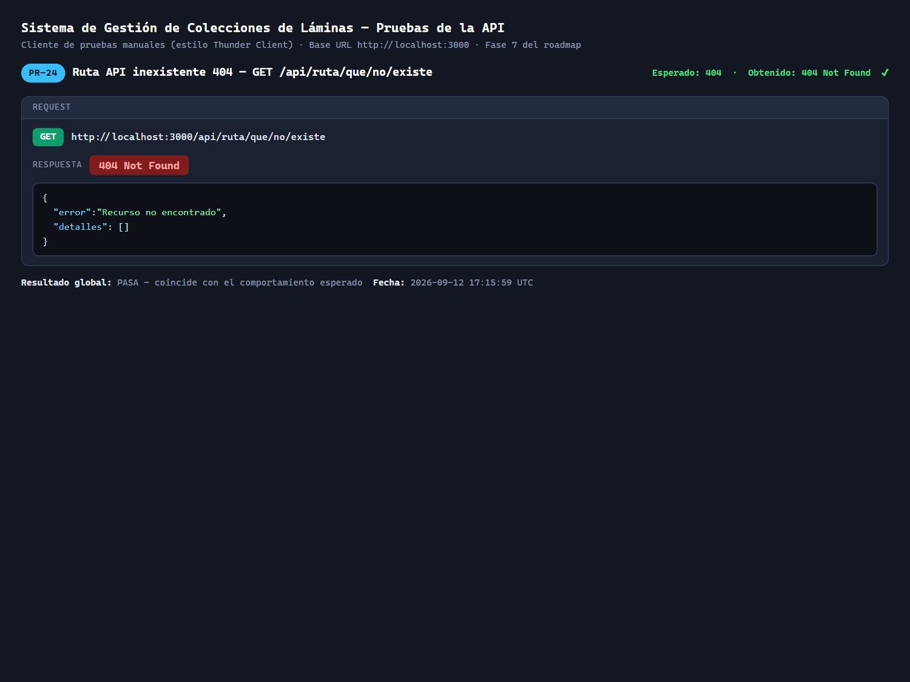

### PR-25 — Eliminar lámina
- **Método/Ruta:** `DELETE /api/laminas/7`
- **Esperado:** `204 No Content`
- **Obtenido:** `204 No Content` ✔
- **Screenshot:** `screenshots/25-eliminar-lamina.png`

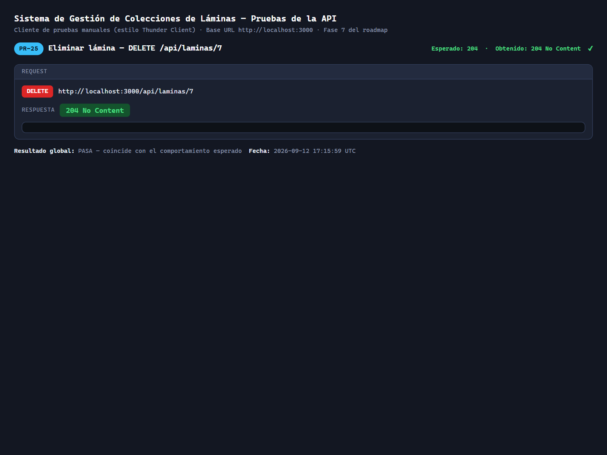

### PR-26 — Eliminar álbum (cascada)
- **Método/Ruta:** `DELETE /api/albumes/2`
- **Esperado:** `204 No Content` — borra el álbum y sus láminas (FK `ON DELETE CASCADE`).
- **Obtenido:** `204 No Content` ✔ — la base queda con el seed (álbum 1 y sus 6 láminas).
- **Screenshot:** `screenshots/26-eliminar-album.png`

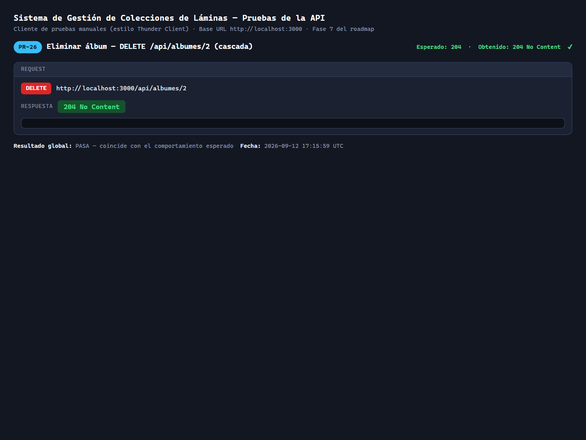

---
## Web MVC (vistas Boostrap oscuras)

### PR-27 — Listado de álbumes
- **Método/Ruta:** `GET /albumes`
- **Esperado:** tarjetas con el álbum del seed + tabla resumen.
- **Obtenido:** ✔ listado renderizado con tema oscuro.
- **Screenshot:** `screenshots/30-listado-albumes.png`

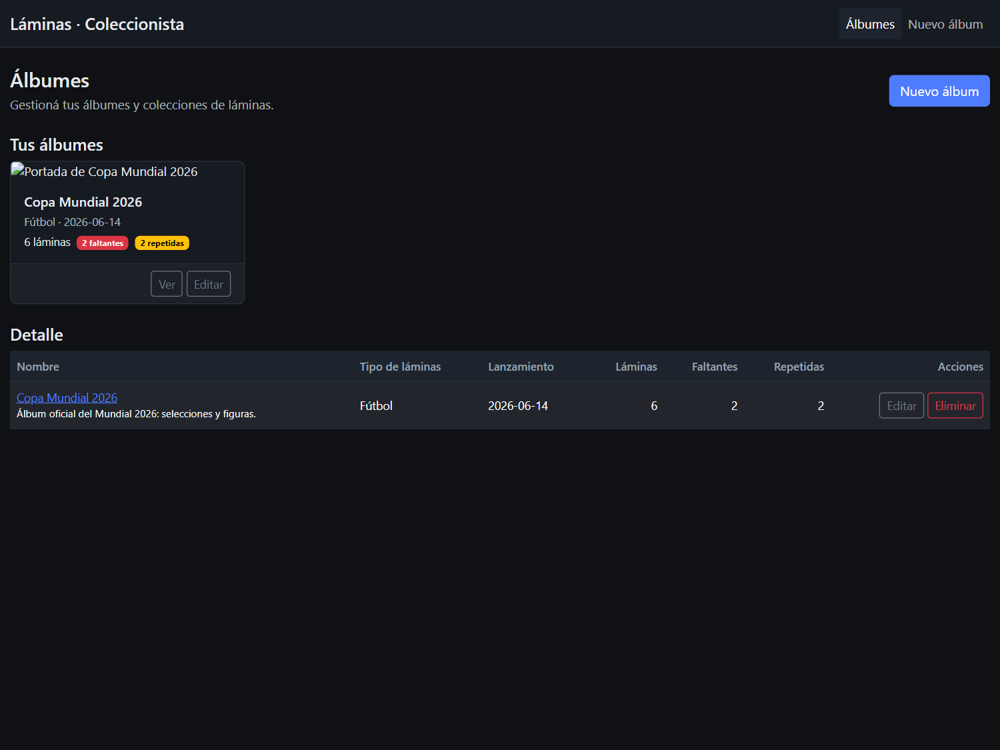

### PR-28 — Detalle de álbum
- **Método/Ruta:** `GET /albumes/1`
- **Esperado:** detalle con tabla de láminas y badges de estado (Faltante / Única / Repetida ×N).
- **Obtenido:** ✔
- **Screenshot:** `screenshots/31-detalle-album.png`

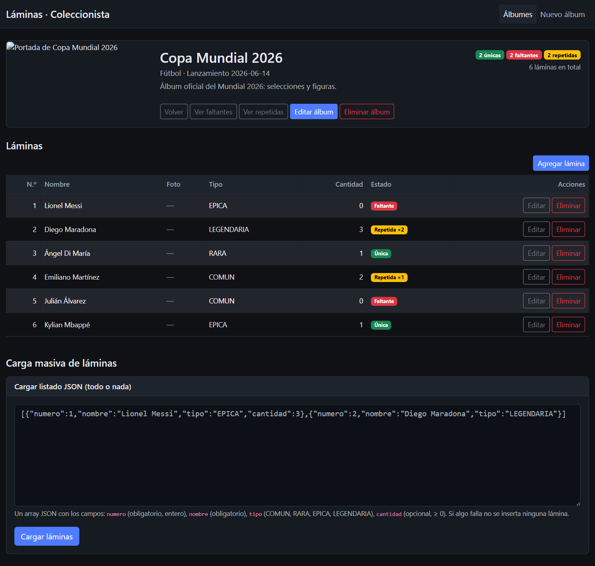

### PR-29 — Formulario de álbum
- **Método/Ruta:** `GET /albumes/nuevo`
- **Esperado:** formulario con nombre, tipo de láminas, fecha, portada (opcional) y descripción.
- **Obtenido:** ✔
- **Screenshot:** `screenshots/32-form-album.png`

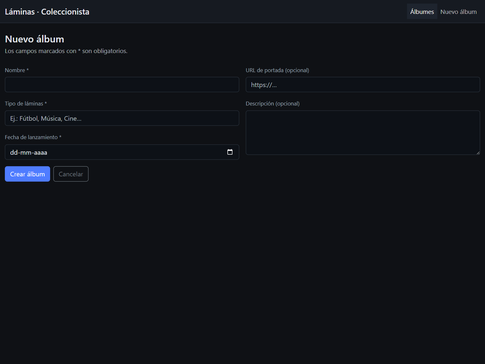

### PR-30 — Formulario de lámina
- **Método/Ruta:** `GET /albumes/1/laminas/nueva`
- **Esperado:** formulario con número, nombre, tipo (select), cantidad y foto.
- **Obtenido:** ✔
- **Screenshot:** `screenshots/33-form-lamina.png`

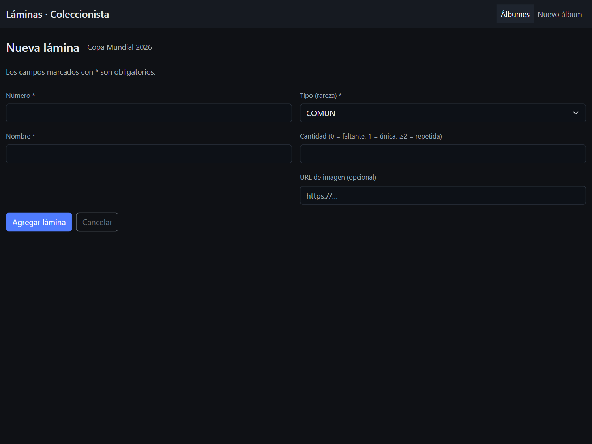

### PR-31 — Faltantes (vista web)
- **Método/Ruta:** `GET /albumes/1/laminas/faltantes`
- **Esperado:** listado de las 2 láminas con `cantidad = 0`.
- **Obtenido:** ✔
- **Screenshot:** `screenshots/34-faltantes.png`

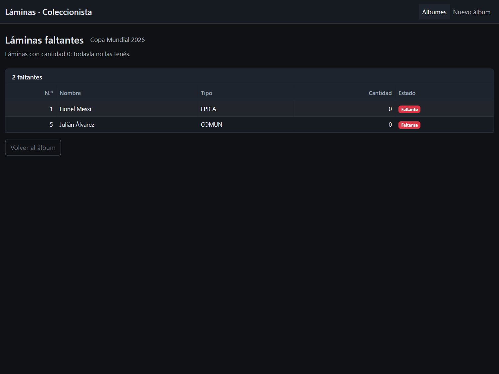

### PR-32 — Repetidas (vista web)
- **Método/Ruta:** `GET /albumes/1/laminas/repetidas`
- **Esperado:** listado con `cantidadRepetidas = cantidad − 1` (Maradona ×2, Martínez ×1).
- **Obtenido:** ✔
- **Screenshot:** `screenshots/35-repetidas.png`

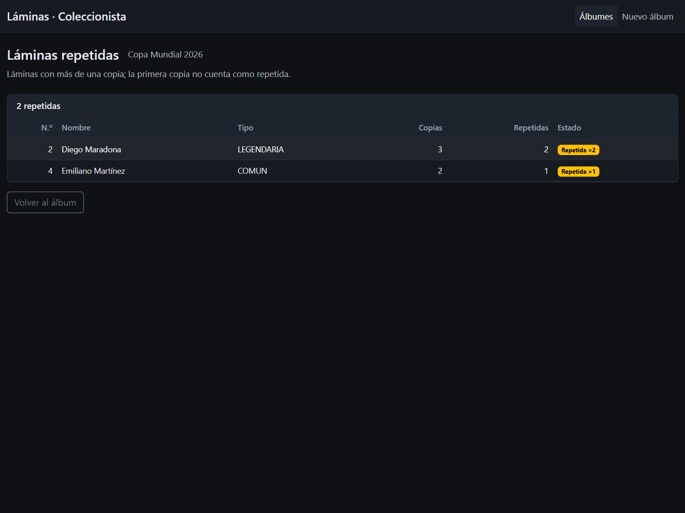

### PR-33 — Alta de álbum desde el formulario web (PRG)
- **Método/Ruta:** `POST /albumes` (formulario `GET /albumes/nuevo`)
- **Esperado:** redirección 303 con `?ok=Álbum creado correctamente` y el álbum visible en el listado.
- **Obtenido:** ✔ `303 → /albumes/3?ok=%C3%81lbum%20creado%20correctamente`, alerta “Álbum creado correctamente”, álbum en el listado (luego eliminado para limpieza del entorno).
- **Screenshot:** `screenshots/36-crear-album-web.png`

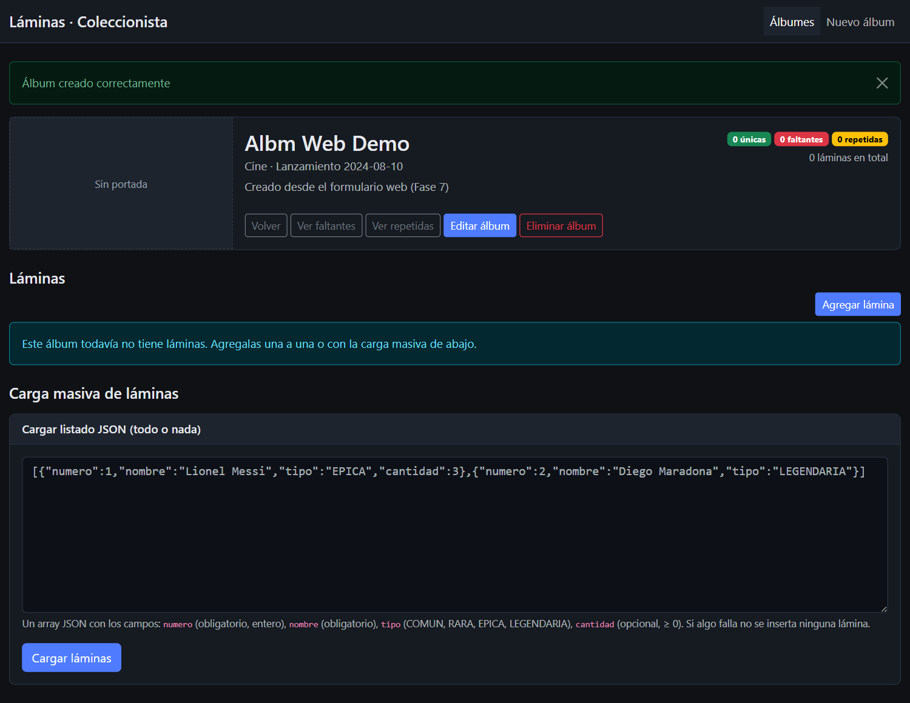

---
## 5. Cobertura de errores (formato uniforme `{ "error", "detalles" }`)

| Código | Casos probados | Resultado |
|---|---|---|
| `400` | POST álbum vacío (validación por campo), `:id` no entero, PATCH sin campos, foto con extensión no permitida | ✔ formato uniforme |
| `404` | álbum inexistente, lámina inexistente, ruta `/api/*` desconocida | ✔ |
| `409` | duplicado de número al crear y al actualizar, rollback del bulk | ✔ |

## 6. Conclusión

> Todas las pruebas manuales (31 en total) pasaron: **resultado obtenido = resultado esperado** en el 100 % de los casos. La API cumple el contrato documentado en `docs/API.md` (códigos 2xx/400/404/409 y formato de error uniforme), la lógica de negocio respeta el BRIEF §7 (estado derivado 0/1/≥2, bulk todo-o-nada, `cantidadRepetidas = cantidad − 1`) y las vistas web MVC funcionan con el tema oscuro de `docs/style.md`, incluyendo el patrón PRG con mensajes `?ok=`. Los tests automatizados Vitest (`npm test` = 38) complementan sin sustituir esta evidencia manual.

---
## 7. Sesión con Chrome DevTools (navegador Chromium real) — flujos desde `/`

> **Fecha:** 2026-09-12 · **Cliente:** Chromium headless vía Chrome DevTools (accesibilidad + red + consola de recursos), flujo completo de la web MVC **comenzando en la raíz**.
> **Evidencia:** snapshot del árbol de accesibilidad, entradas de red (`performance.getEntriesByType('resource')`) y respuestas HTTP reales por cada paso. Las capturas de pantalla de la sesión se guardaron fuera del repositorio (directorio temporal del harness, formato webp) y no se incorporaron al informe.

### PR-34 — Raíz redirige a la web MVC
- **Método/Ruta:** `GET /` (primer paso de la sesión)
- **Esperado:** `302 → /albumes`.
- **Obtenido:** ✔ `302 Location: http://localhost:3000/albumes` (verificado en el navegador y con `curl -I`). El listado carga: título “Álbumes · Coleccionista de Láminas”, 1 álbum del seed con “6 láminas · 2 faltantes · 2 repetidas”.
- **Red:** bootstrap.min.css/app.css/bundle.js → `200`; única falla: `https://ejemplo.com/portada-mundial-2026.png` (URL ficticia del seed, no de la app).

### PR-35 — Alta de álbum por formulario (PRG)
- **Método/Ruta:** `GET /albumes/nuevo` → `POST /albumes`
- **Obtenido:** ✔ `303 → /albumes/12?ok=Álbum creado correctamente`; alerta visible; detalle con “0 láminas en total” y sección de carga masiva.

### PR-36 — Alta individual de láminas (estados 0/1/≥2)
- **Método/Ruta:** `GET /albumes/12/laminas/nueva` → `POST /albumes/12/laminas` ×3
- **Obtenido:** ✔ Lámina 1 RARA `cantidad 0` → badge “Faltante”; Lámina 2 EPICA `1` → “Única”; Lámina 3 COMUN `3` → “Repetida ×2” (`cantidadRepetidas = cantidad − 1`). Cada alta redirige con `?ok=Lámina "…" agregada`.

### PR-37 — Carga masiva OK desde el textarea
- **Método/Ruta:** `POST /albumes/12/laminas/bulk` (formulario del detalle)
- **Obtenido:** ✔ `303 → ?ok=3 láminas cargadas correctamente`; la tabla pasa de 3 a 6 filas; “Repetida ×1” para `cantidad 2`; “Faltante” y “Única” correctos.

### PR-38 — Carga masiva con duplicado → todo-o-nada
- **Método/Ruta:** `POST /albumes/12/laminas/bulk` con lote `[ {numero:4(existente)}, {numero:7} ]`
- **Obtenido:** ✔ alerta “Ya existe una lámina con ese número en este álbum; no se cargó ninguna”; la tabla sigue con 6 filas; la lámina 7 **no** existe (rollback).

### PR-39 — Vistas faltantes / repetidas
- **Método/Ruta:** `GET /albumes/12/laminas/faltantes` y `/albumes/12/laminas/repetidas`
- **Obtenido:** ✔ faltantes = Lámina 1 y Lámina 6 (las dos con `cantidad 0`); repetidas = Lámina 3 (×2) y Lámina 4 (×1).

### PR-40 — Edición de álbum: **BUG encontrado y corregido durante la prueba**
- **Ruta:** `GET /albumes/12/editar`
- **Esperado:** formulario precargado con los datos del álbum.
- **Obtenido (bug):** el campo `fechaLanzamiento` se renderizaba con el valor **inválido** `Fri Sep 11 2026 21:00:00 GMT-0300 (hora de verano de Chile)` — el `Date` de Prisma serializado por EJS a `toString()`. Un `<input type="date">` con ese valor queda vacío en el navegador, y al enviar el formulario la validación Zod rechaza `fechaLanzamiento=""` (“es obligatorio” en `invalid-feedback`). **Consecuencia: editar un álbum sin reescribir la fecha era imposible.**
- **Causa raíz:** `vistaFormEditar` (src/controllers/album.controller.ts) pasaba `datos: album` (objeto Prisma crudo) mientras que detalle/listado serializan con `serializarAlbum()` (src/models/album.model.ts aplica `aFormatoFecha`).
- **Corrección:** `datos: serializarAlbum(album)` en `vistaFormEditar` — misma convención que el resto de vistas.
- **Verificación post-fix:** ✔ el formulario precarga `2026-09-12`; editar (nombre + descripción) → `303 → /albumes/12?ok=Álbum actualizado correctamente`; `<h1>` muestra “Álbum Web DevTools (editado)”.

### PR-41 — Edición de lámina
- **Ruta:** `GET /laminas/42/editar` → `POST` (cantidad 3 → 5)
- **Obtenido:** ✔ precarga correcta (número 3, COMUN, cantidad 3); `303 → ?ok=Lámina actualizada correctamente`; cantidad 5 persistida (la API `/api/laminas/42` devuelve `cantidad: 5`).

### PR-42 — Subida de foto
- **Ruta:** `POST /laminas/42/foto` (multipart, `registro` de prueba PNG de 68 bytes)
- **Obtenido:** ✔ `303 → /laminas/42/editar?ok=Foto subida correctamente`; archivo en `uploads/laminas/42_*.png`; `GET /uploads/laminas/42_*.png` → `200 image/png`; `` visible en el formulario y en la tabla (celda “Foto”).

### PR-43 — Eliminaciones con `confirm()` + cascada
- **Ruta:** `POST /laminas/42/eliminar` y `POST /albumes/12/eliminar`
- **Obtenido:** ✔ el `onsubmit="return confirm(...)"` de los tres formularios (detalle lámina, detalle álbum, listado) está presente en las plantillas; con el diálogo aceptado: lámina eliminada (`?ok=Lámina "Lámina 3 Prueba" eliminada`, 6→5 filas) y álbum eliminado con **cascada** (`?ok=Álbum "…" eliminado`); el listado vuelve al seed (solo “Copa Mundial 2026”) y `/api/albumes` devuelve solo el álbum 1. `/api/laminas/42` → `404 {"error":"Lámina no encontrada"}`.

### PR-44 — 404 web
- **Ruta:** `GET /albumes/999` y `GET /albumes/999/laminas/faltantes`
- **Obtenido:** ✔ `404 Página no encontrada`.

**Observación (no corregida, fuera del contrato probado):** `src/lib/upload.ts` solo escribe archivos; eliminar una lámina/álbum no borra su foto de `uploads/laminas/` (queda un huérfano en disco). No afecta la API ni la web, pero es fuga de almacenamiento con el tiempo.

**Resultado de la sesión:** 11 flujos verificados en navegador real desde `/`; **1 bug corregido** (PR-40) y 1 observación registrada. Tras la sesión la BD quedó en el estado del seed.

### 7.1 Sesión coleccionista (recorrido de uso real, 2026-09-12)

> Ejecutada con Chromium real **roleando como el usuario final**: el coleccionista revisa su vitrina, decide qué cazar/canjear, registra adquisiciones, sube la foto de la lámina física y arma una colección nueva. Al cierre la BD se restaura al seed (convención del proyecto).

| Paso | Acción del coleccionista | Resultado |
|---|---|---|
| CP-01 | Entra a `/` → cae al listado; lee la tarjeta: “6 láminas · 2 faltantes · 2 repetidas” | ✔ |
| CP-02 | Abre “Copa Mundial 2026”: filas con badges Faltante (Messi, Álvarez) / Única / Repetida ×N | ✔ |
| CP-03 | “Ver faltantes” → le faltan Messi (n.º 1) y Álvarez (n.º 5); “Ver repetidas” → tiene Maradona ×2 y Martínez ×1 de cambio | ✔ |
| CP-04 | **Canjea** una Maradona repetida: edita `cantidad 3 → 2` → `?ok=Lámina actualizada correctamente`; badge pasa a “Repetida ×1” | ✔ |
| CP-05 | **Registra adquisiciones** (consiguió Messi y Álvarez): `cantidad 0 → 1` en ambas → la vitrina global pasa a **0 faltantes** | ✔ |
| CP-06 | **Sube la foto** de la Messi física (PNG de 68 bytes) → `?ok=Foto subida correctamente`; `` aparece en la celda “Foto” y en el formulario; `GET /uploads/laminas/1_*.png` → `200 image/png` | ✔ |
| CP-07 | **Arma colección nueva** “Fórmula 1 2025”: alta por formulario (PRG ✔) + carga masiva de 4 láminas (Verstappen/Hamilton únicas, Leclerc faltante, Alonso ×2) → `?ok=4 láminas cargadas correctamente` | ✔ |
| CP-08 | **Se equivoca**: intenta registrar otra Verstappen en el mismo lote que una Norris → “Ya existe una lámina con ese número… no se cargó ninguna”; la Norris tampoco se insertó (rollback todo-o-nada) | ✔ |
| CP-09 | Registra a Norris aparte (individual) → 5 láminas; estadísticas: `total 5 · faltantes 1 · repetidas 1 · completado 80 %`; “Ver faltantes” = Leclerc, “Ver repetidas” = Alonso ×1 | ✔ |
| CP-10 | Cierre: borra el álbum F1 (cascada, `204`) y revierte Messi/Álvarez/Maradona a los valores del seed → vitrina de nuevo en estado inicial (2 faltantes, 2 repetidas, `uploads/` vacío) | ✔ |

**Semántica del total “repetidas” (pregunta abierta en la sesión, resuelta contra el BRIEF):** el agregado del álbum (`/api/albumes` y `/estadisticas`) y el `totalRepetidas` de `/laminas/repetidas` cuentan **láminas con `cantidad ≥ 2`** (BRIEF §7), mientras que el excedente va **por lámina**: `cantidadRepetidas = cantidad − 1` (RF-3.3, ejemplo de `docs/API.md`: Maradona `cantidad 3` → `totalRepetidas 1`, `cantidadRepetidas 2`). La implementación coincide con el contrato; no se requiere cambio. Verificado en vivo: `/api/albumes/1/laminas/repetidas` → `totalRepetidas: 2` (Maradona `×2`, Martínez `×1`).

**Resultado:** 10 pasos del recorrido coleccionista, todos con resultado esperado = obtenido, cerrando la BD en el estado del seed.